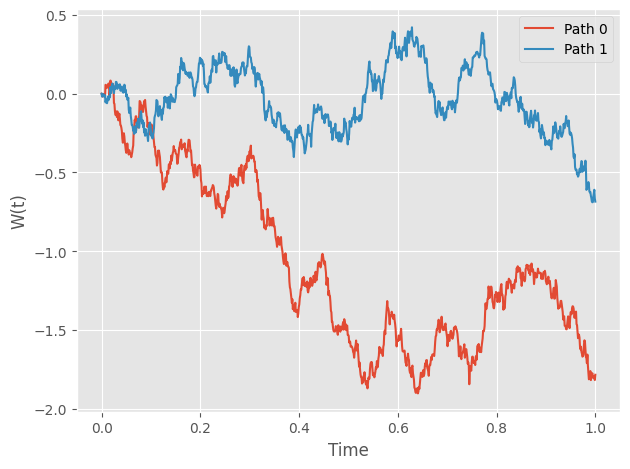
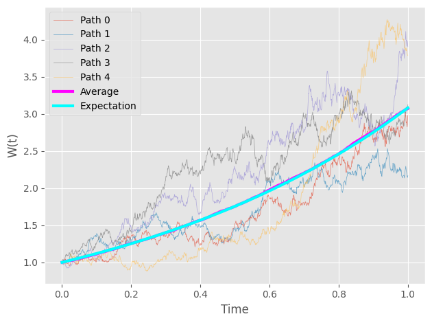

The basic ingredients: Brownian Motions
=============================================
There is no doubt that as simply as it might be, 
brownian motion is one of the most fundamental model in 
stochastic calculus. In this section, we will walk you 
through how to generate a series of brownian motions using 
our package. 

.. note:: 
    Before you jumpy into the details, please make sure 
    that you have installed all the dependencies. 

Generate Brownian Paths
----------------------------
To generate brownian motions, you just need to instantiate 
a ``sde_class`` object. Let's start by simulating 2 brownian
paths on the interval [0,1] with 1,000 time steps. In your interactive Python session: 

.. code-block:: python

    import numpy as np 
    from sde import sde_class 
    from matplotlib import pyplot as plt 

    # Initialize an sde_class object 
    sde = sde_class(T=1, N=1000, M=2)

    # Visualize the paths 
    plt.style.use('ggplot')
    for path in range(2):
        plt.plot(sde.time, sde.W[path,:],
                label="Path "+str(path))
    plt.legend()
    plt.xlabel("Time")
    plt.ylabel("W(t)")
    plt.tight_layout()

You should get something similar to this: 

Simple. Isn't it?

Transform Brownian Paths 
----------------------------
Although Brownian Motion itself is an interesting model, 
lots of statistics and physics models are constructed by 
manipulating Brownian paths. 

In this section, we demonstrate how to transform simulated 
brownian paths via a user-defined function: :math:`\exp(t + \dfrac{1}{2}W(t))`
For this function, we can actually compute this expectation at
each time point analytically: :math:`\exp(\dfrac{9t}{8})`. 

.. tip:: 
    Wondering how? Just remember :math:`W(t)\sim N(0,t)`

.. code-block:: python
    
    # Initialize an sde_class object 
    sde = sde_class(T=1, N=1000, M=1000)

    # Define the transformation function 
    def u(t, w):
        return np.exp(t + 0.5 * w)
    
    # Transform 
    transformed_W = sde.transform_W(fun=u)

    # Visualize the paths 
    # We only show 5 paths to avoid clutted plot
    for path in range(5):
        plt.plot(sde.time, transformed_W[path,:],
                label="Path "+str(path),
                linewidth=0.5, alpha=0.7)

    plt.plot(sde.time, np.mean(transformed_W, axis=0),
            linewidth=3, c='magenta',
            label="Average")
    plt.plot(sde.time, np.exp(9*sde.time/8),
            linewidth=3, c='cyan',
            label="Expectation")
    plt.legend()
    plt.xlabel("Time")
    plt.ylabel("W(t)")
    plt.tight_layout()

You should get something similar to this: 

As you can see, the computed average is pretty close to 
the analytical solution.