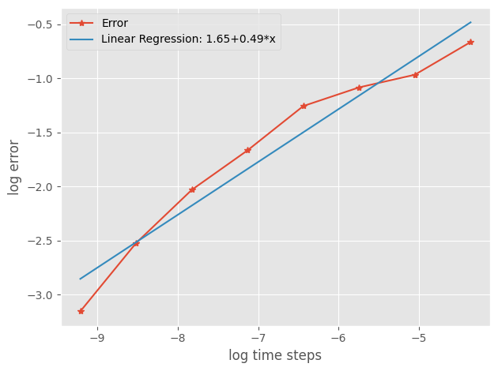
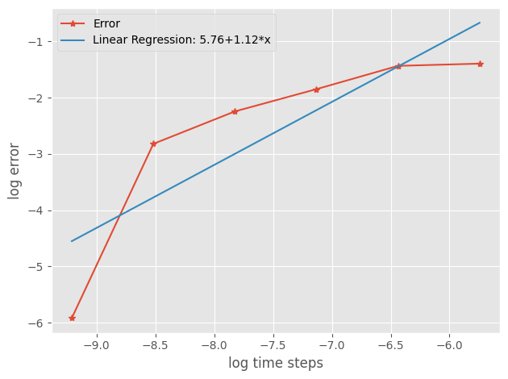
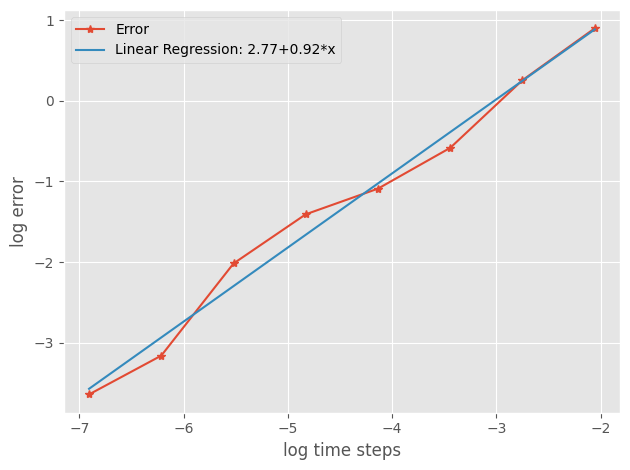
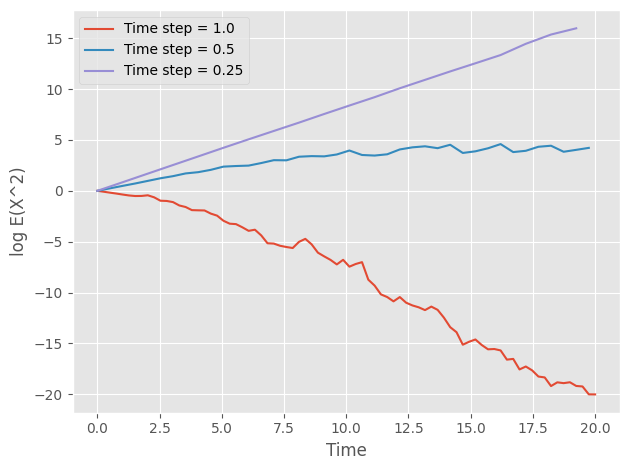
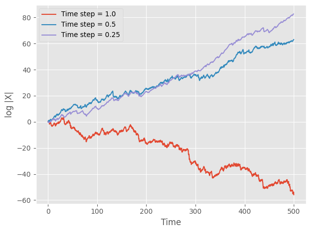

Convergence and Stability
==================================
So I see you are of the paranoid type and get suspicious 
about numerical methods. That's what this section is for. 
We demonstrate by using our package various aspects of 
convergence of the numerical methods we included in the package. 

.. note:: 
    The simulation in the paper might take a looooong time 
    to run. 

The SDE we will use is the same as the one we investigated in :doc:`/sde`

.. math:: 
    dX(t) = \lambda X(t)dt + \mu X(t)dW(t)

Strong Convergence 
-----------------------
A method is said to have strong order of convergence equal to 
:math:`\gamma` if 

.. math:: 
    E|X_n - X(\tau)| \leq C\Delta t^\gamma, ~ \exists C

The Eular-Maruyama (EM) method can be shown to have strong 
order of convergence :math:`\gamma=\dfrac{1}{2}`. To validate this,
we can simulate multiple Brownian Motions, compute the SDE using the 
EM method, and compare the absolute errors with the ground truth. 

.. code-block:: python 

    # Generate BMs
    sde = sde_class(T=1, N=10000, M=1000)
    # Define mu and sigma functions 
    def mu_fun(x):
        return 2 * x
    def sigma_fun(x):
        return x
    # Define time steps 
    R_seq = np.array([1,2,4,8,16,32,64,128])
    X_dict = {}
    for R in R_seq:
        X = sde.euler_maruyama(mu_fun=mu_fun,
                            sigma_fun=sigma_fun,
                            x0=1,
                            R=R)
        X_dict[R] = X
    # Compute errors 
    error_df = []
    for R in X_dict:
        rows = [[err, R] for err in np.abs(X_dict[R][:,-1] - \
                np.exp((2-0.5) + sde.W[:,-1]))]
        error_df += rows
    error_df = pd.DataFrame(error_df, columns=["Error", "R"])
    # Compute group mean and lr
    log_err = np.log(error_df.groupby(['R'])['Error'].mean().values)
    m, b = np.polyfit(np.log(sde.dt * R_seq), log_err,1)
    # Visualize the results 
    plt.style.use('ggplot')
    plt.plot(np.log(sde.dt * R_seq), 
            log_err, marker="*",
            label="Error")
    plt.plot(np.log(sde.dt * R_seq), 
            m*np.log(sde.dt * R_seq)+b,
            label="Linear Regression: "+
            str(np.round(b,2)) + 
            "+" + str(np.round(m,2))+"*x")
    plt.xlabel("log time steps")
    plt.ylabel("log error")
    plt.tight_layout()
    plt.legend()
    plt.show()

We can also validate the strong order of convergence of the Milstein's 
method is 1. 

.. code-block:: python 

    # Generate BMs
    sde = sde_class(T=1, N=10000, M=1000)
    # Define mu and sigma functions 
    def mu_fun(x):
        return 2 * x
    def sigma_fun(x):
        return x
    def d_sigma_fun(x):
        return 1
    # Milstein 
    R_seq = np.array([1,2,4,8,16,32])
    X_dict = {}
    for R in R_seq:
        X = sde.milstein(mu_fun=mu_fun,
                        sigma_fun=sigma_fun,
                        d_sigma_fun=d_sigma_fun,
                        x0=1,
                        R=R)
        X_dict[R] = X
    # Compute error 
    error_df = []
    for R in X_dict:
        rows = [[err, R] for err in np.abs(X_dict[R][:,-1] - \
                np.exp((2-0.5) + sde.W[:,-1]))]
        error_df += rows
    error_df = pd.DataFrame(error_df, columns=["Error", "R"])
    # Visualize 
    log_err = np.log(error_df.groupby(['R'])['Error'].mean().values)
    m,b = np.polyfit(np.log(sde.dt * R_seq), log_err,1)
    plt.style.use('ggplot')
    plt.plot(np.log(sde.dt * R_seq), 
            log_err, marker="*",
            label="Error")
    plt.plot(np.log(sde.dt * R_seq), 
            m*np.log(sde.dt * R_seq)+b,
            label="Linear Regression: "+
            str(np.round(b,2)) + 
            "+" + str(np.round(m,2))+"*x")
    plt.xlabel("log time steps")
    plt.ylabel("log error")
    plt.tight_layout()
    plt.legend()
    plt.show()

Weak Convergence 
------------------------
A method is said to have weak order of convergence equal to 
:math:`\gamma` if 

.. math:: 
    |Ep(X_n) - Ep(X(\tau))| \leq C\Delta t^\gamma, ~ \exists C, ~ \forall p \text{ in some class}

The Eular-Maruyama (EM) method can be shown to have weak 
order of convergence :math:`\gamma=1`. To validate this,
we can simulate multiple Brownian Motions, compute the SDE using the 
EM method, and compare the absolute errors with the ground truth. 

.. code-block:: python 

    def mu_fun(x):
        return 2 * x
    def sigma_fun(x):
        return 0.1*x
    R_seq = np.array([1,2,4,8,16,32,64,128])
    EX = np.zeros(len(R_seq))
    for i, R in enumerate(R_seq):
        sde = sde_class(T=1, N=1000, M=5000)
        X = sde.euler_maruyama(mu_fun=mu_fun,
                            sigma_fun=sigma_fun,
                            x0=1,
                            R=R)
        EX[i] = np.mean(X[:,-1])
    # Compute error and visulalize 
    m, b = np.polyfit(np.log(sde.dt * R_seq), 
                    np.log(np.abs(EX-np.exp(2))),1)
    plt.style.use('ggplot')
    plt.plot(np.log(sde.dt * R_seq), 
            np.log(np.abs(EX-np.exp(2))), marker="*",
            label="Error")
    plt.plot(np.log(sde.dt * R_seq), 
            m*np.log(sde.dt * R_seq)+b,
            label="Linear Regression: "+
            str(np.round(b,2)) + 
            "+" + str(np.round(m,2))+"*x")
    plt.xlabel("log time steps")
    plt.ylabel("log error")
    plt.tight_layout()
    plt.legend()
    plt.show()

Linear Stability
------------------------
Stability mainly concerns with the ability of a method 
to reproduce a certain qualitative feature of an SDE. 

In this section, we will again use 

.. math:: 
    dX(t) = \lambda X(t)dt + \mu X(t)dW(t)

And the feature we are interested in is :math:`\underset{t\to\infty}{\lim}X(t)=0`
(Of course in some "probability" sense).

There are metrics we will use 

.. math:: 
    \underset{t\to\infty}{\lim}E(X^2(t)) = 0\\
    \underset{t\to\infty}{\lim}|X(t)| = 0 ~a.s

As we know the analytic solution, we know the conditions we 
need to impose on :math:`\lambda, \mu`.

.. math:: 
    \underset{t\to\infty}{\lim}E(X^2(t)) = 0 \Leftrightarrow 2\lambda + \mu^2 < 0\\ 
    \underset{t\to\infty}{\lim}|X(t)| = 0 ~a.s \Leftrightarrow \lambda - \dfrac{1}{2}\mu^2 <0

Given the region of :math:`\lambda, \mu`, we are interested in finding out 
the time steps of the Eular-Maruyama that can reproduce these features. 

Based on the EM method, we have for mean-square stability

.. math:: 
    X_{j} - X_{j-1} = X_{j-1}(\lambda dt + \mu dWt)\\
    E(X_{j})^2 = E(X_{j-1})^2E(1+\lambda dt + \mu dWt)^2\\
    E(X_{j})^2 = E(X_{j-1})^2E((1+\lambda dt)^2 + \mu^2 dt)

This yields :math:`(1+\lambda dt)^2 + \mu^2 dt<1`

For asymptotic stability,

.. math:: 

    |X_{j}| = |X_{0}|\prod|(1+\lambda dt + \mu dWt)|\\
    \log X_{j} = \sum \log|(1+\lambda dt + \mu dWt)| = \sum \log|N(1+\lambda dt, \mu^2 dt)|\\

We than normalize both sides with mean :math:`m` and variance :math:`s^2`,

.. math::  
    (\log X_{j}-nm)/\sqrt{n}s = (\sum \log|(1+\lambda dt + \mu dWt)| - nm)/\sqrt{n}s \to 0, a.s 

Now if :math:`E\log|(1+\lambda dt + \mu dWt) < 0`, we have 

.. math:: 
    \underset{t\to\infty}{\lim\sup}[(\log X_{j}-nm)/\sqrt{n}s]/[2t\log\log t] = 1 \Rightarrow \underset{j\to\infty}{\lim}|X_j| = 0

Mean-Square Stability
~~~~~~~~~~~~~~~~~~~~~~~~~~

.. code-block:: python 

    #Generate BMs
    sde = sde_class(T=20, N=80, M=50000)
    # EM
    def mu_fun(x):
        return -3 * x
    def sigma_fun(x):
        return np.sqrt(3)*x
    R_seq = np.array([1,2,4])
    X_dict = {}
    for R in R_seq:
        X = sde.euler_maruyama(mu_fun=mu_fun,
                            sigma_fun=sigma_fun,
                            x0=1,
                            R=R)
        X_dict[R] = X
    # Visualize mean-square 
    for R in X_dict:
        plt.plot(sde.time[::R],
                np.log10(np.mean(X_dict[R]**2, axis=0)),
                label="Time step = "+str(1/R))
    plt.xlabel("Time")
    plt.ylabel("log E(X^2)")
    plt.tight_layout()
    plt.legend()
    plt.show()

Asymptotic
~~~~~~~~~~~~~~~~~

.. code-block:: python 

    # Generate BMs and carry out EM 
    sde = sde_class(T=500, N=2000, M=1)
    def mu_fun(x):
        return 0.5 * x
    def sigma_fun(x):
        return np.sqrt(6)*x
    R_seq = np.array([1,2,4])
    X_dict = {}
    for R in R_seq:
        X = sde.euler_maruyama(mu_fun=mu_fun,
                            sigma_fun=sigma_fun,
                            x0=1,
                            R=R)
        X_dict[R] = X

    # Visualize asymptotic 
    for R in X_dict:
        plt.plot(sde.time[::R],
                np.log10(np.abs(X_dict[R][0,:])),
                label="Time step = "+str(1/R))
    plt.xlabel("Time")
    plt.ylabel("log |X|")
    plt.tight_layout()
    plt.legend()
    plt.show()

