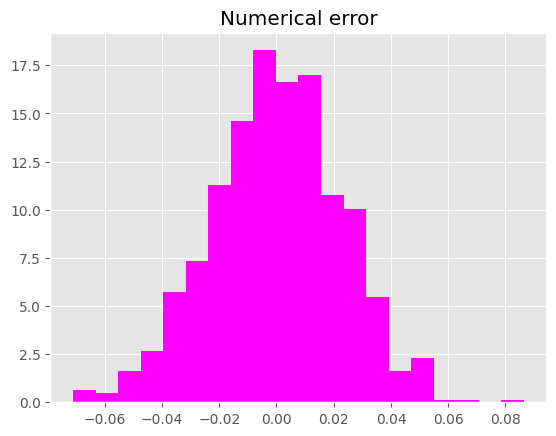
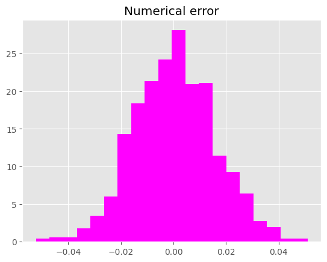

Stochastic Integrals 
============================
Ito Integrals
--------------------
One of the most fundamental tools in SDE is Ito
integral. The basic idea is to mimic the Riemann sum 
but only with the left-most point. (The process is thus 
*non-anticipating*)

In its discrete form, suppose we have a function :math:`h(t)`,
then its "Ito" sum is

.. math:: 
    \sum_{j=0}^{N-1}h(t_j)(W(t_{j+1}) - W(t_j))

By using our package, you can easily compute the approximate 
Ito integral. To demonstrate, suppose :math:`h(t)=W(t)`.
This is actually one of the rare cases where we can find the 
analytical solution

.. math:: 
    \int_{0}^{T}W(t)dW(t) = \dfrac{1}{2}W(T)^2 - \dfrac{1}{2}T

.. tip:: 
    Wondering how it's done? Just use the definition. 

.. code-block:: python 
    
    from sde.sde_class import sde_class
    import numpy as np 
    from matplotlib import pyplot as plt
    # Initialize sde_class object
    sde = sde_class(T=1, N=1000, M=1000)
    # Define integrand 
    def h(t, w):
        return w
    # Ito integral 
    results = sde.integrate(fun=h, 
                            integral_type="Ito")
    # Visualize the results 
    plt.style.use('ggplot')
    plt.hist(results - 0.5*sde.W[:,-1]**2 + 0.5,
            bins=20, density=True, color="magenta")
    plt.title("Numerical error")
    plt.show()

You should get something similar to this: 

Stratonovich Integrals
------------------------
Ito integral approximates using the left-most point. In practice,
there is nothing stopping you from using any other point in between. 
Stratonovich integral uses the middle point. 

.. math:: 
    \sum_{j=0}^{N-1}h(\dfrac{t_j + t_{j+1}}{2})(W(t_{j+1}) - W(t_j))

Again, we will use :math:`h(t)=W(t)` to demonstrate.
The analytical solution is given by

.. math:: 
    \int_{0}^{T}W(t)dW(t) = \dfrac{1}{2}W(T)^2

.. tip:: 
    Wondering how it's done? 

.. code-block:: python

    # Stratonovich integral 
    results = sde.integrate(fun=h, 
                            integral_type="Stratonovich")
    # Visualize the results 
    plt.style.use('ggplot')
    plt.hist(results - 0.5*sde.W[:,-1]**2,
            bins=20, density=True, color="magenta")
    plt.title("Numerical error")
    plt.show()

You should get something similar to this: 

