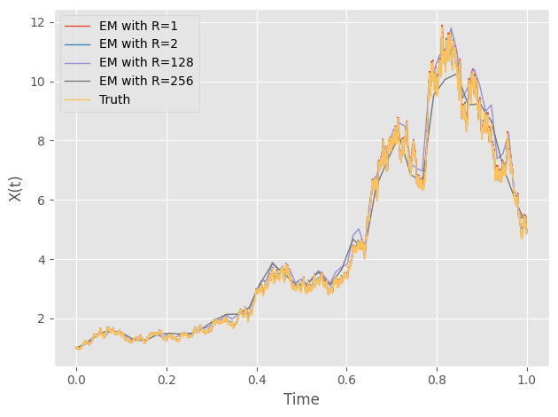
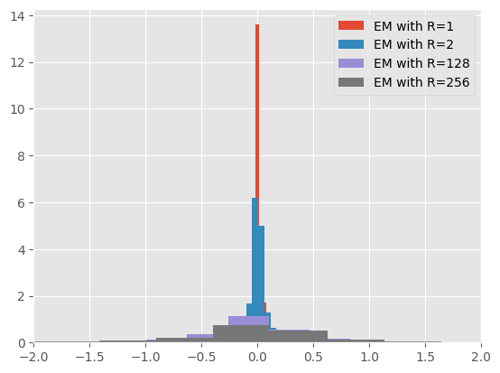

Stochastic Differential Equations
=====================================
An SDE can be written as 

.. math:: 
    X(t) = X(0) + \int_{0}^{t}f(X(s))ds + \int_{0}^{t}g(X(s))dW(s)

or formally 

.. math:: 
    dX(t) = f(X(t))dt + g(X(t))dW(t)

In this section, we will showcase how to use our package 
to solve SDEs numerically.

The Euler-Maruyama Method 
----------------------------
Once we have the "differential" way of expressing an SDE, 
the Eular-Maruyama method becomes intuitive. It simply takes 
the form of 

.. math:: 
    X_j = X_{j-1} + f(X_{j-1})\Delta t + g(X_{j-1})(W(\tau_j) - W(\tau_{j-1}))

To demonstrate, we use the linear SDE:

.. math:: 
    dX(t) = \lambda X(t)dt + \mu X(t)dW(t)

As a matter of fact, we have the analytical solution to this SDE:

.. math:: 
    X(t) = X(0)\exp((\lambda - \dfrac{1}{2}\mu^2)t + \mu W(t))

We will take :math:`\lambda=2, ~ \mu=1` and :math:`X_0=1`

.. code-block:: python

    from sde.sde_class import sde_class
    import numpy as np 
    from matplotlib import pyplot as plt
    # Generate BM
    sde = sde_class(T=1, N=10000, M=1000)
    # Define drift and diffusion
    def mu_fun(x):
        return 2 * x
    def sigma_fun(x):
        return x
    # EM 
    X_dict = {}
    for R in [1,2,128,256]:
        X = sde.euler_maruyama(mu_fun=mu_fun,
                                sigma_fun=sigma_fun,
                                x0=1,
                                R=R)
        X_dict[R] = X
    # Visualize the first path 
    plt.style.use('ggplot')
    for R in X_dict:
        plt.plot(sde.time[::R], X_dict[R][0,:], 
                label='EM with R='+str(R),
                linewidth=1)
    plt.plot(sde.time, np.exp((2-0.5)*sde.time + sde.W[0,:]), 
            label="Truth",
            linewidth=1)
    plt.legend()
    plt.xlabel("Time")
    plt.ylabel("X(t)")
    plt.tight_layout()

You should get something similar to this: 

Milstein's Higher Order Method
==================================
As we shall see in :doc:`/convergence`, the EM method, albeit being 
intuitive, has a suboptimal strong order of convergence. The 
Milstein's method improves upon this. However, this does  
come with additional cost of computing the derivatives of the diffusion function. 

We can also compare the errors at the end point among
the time steps 

.. code-block:: python 

    # Compute errors 
    error_dict = {}
    for R in X_dict:
        error_dict[R] = np.zeros(1000)
        for path in range(1000):
            error_dict[R][path] = X_dict[R][path,-1] - \
             np.exp((2-0.5)*1 + sde.W[path,-1])
    # Histogram 
    for R in X_dict:
        plt.hist(error_dict[R],
                density=True, 
                bins=100,
                label='EM with R='+str(R))
    plt.legend()
    plt.xlim([-2,2])
    plt.show()

As we can see, as the step grows larger, the errors grow larger, too. 
For exploration on convergence, check out :doc:`/convergence`
