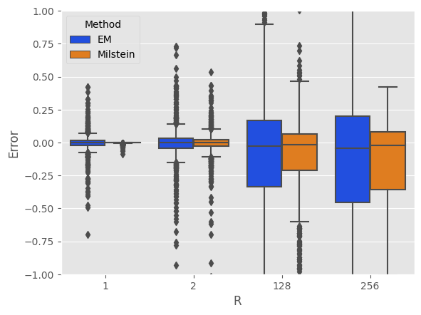

Stochastic Differential Equations
=====================================
An SDE can be written as 

.. math:: 
    X(t) = X(0) + \int_{0}^{t}f(X(s))ds + \int_{0}^{t}g(X(s))dW(s)

or formally 

.. math:: 
    dX(t) = f(X(t))dt + g(X(t))dW(t)

In this section, we will showcase how to use our package 
to solve SDEs numerically.

The Euler-Maruyama Method 
------------------------------
Once we have the "differential" way of expressing an SDE, 
the Eular-Maruyama method becomes intuitive. It simply takes 
the form of 

.. math:: 
    X_j = X_{j-1} + f(X_{j-1})\Delta t + g(X_{j-1})(W(\tau_j) - W(\tau_{j-1}))

To demonstrate, we use the linear SDE:

.. math:: 
    dX(t) = \lambda X(t)dt + \mu X(t)dW(t)

As a matter of fact, we have the analytical solution to this SDE:

.. math:: 
    X(t) = X(0)\exp((\lambda - \dfrac{1}{2}\mu^2)t + \mu W(t))

We will take :math:`\lambda=2, ~ \mu=1` and :math:`X_0=1`

.. code-block:: python

    from sde.sde_class import sde_class
    import numpy as np 
    from matplotlib import pyplot as plt
    # Generate BM
    sde = sde_class(T=1, N=10000, M=1000)
    # Define drift and diffusion
    def mu_fun(x):
        return 2 * x
    def sigma_fun(x):
        return x
    # EM 
    X_dict = {}
    for R in [1,2,128,256]:
        X = sde.euler_maruyama(mu_fun=mu_fun,
                                sigma_fun=sigma_fun,
                                x0=1,
                                R=R)
        X_dict[R] = X
    # Visualize the first path 
    plt.style.use('ggplot')
    for R in X_dict:
        plt.plot(sde.time[::R], X_dict[R][0,:], 
                label='EM with R='+str(R),
                linewidth=1)
    plt.plot(sde.time, np.exp((2-0.5)*sde.time + sde.W[0,:]), 
            label="Truth",
            linewidth=1)
    plt.legend()
    plt.xlabel("Time")
    plt.ylabel("X(t)")
    plt.tight_layout()

You should get something similar to this: 

.. image:: ./images/sde.png
    :width: 600
    :align: center

Milstein's Higher Order Method
-------------------------------------
As we shall see in :doc:`/convergence`, the EM method, albeit being 
intuitive, has a suboptimal strong order of convergence. The 
Milstein's method improves upon this. However, this does  
come with additional cost of computing the derivatives of the diffusion function. 

Continuing the previous example, we can carry out the Milstein's method 
as follows: 

.. code-block:: python 

    # Define derivative function 
    def d_sigma_fun(x):
        return 1
    # Compute Milstein method 
    m_X_dict = {}
    for R in [1,2,128,256]:
        X = sde.milstein(mu_fun=mu_fun,
                        sigma_fun=sigma_fun,
                        d_sigma_fun=d_sigma_fun,
                        x0=1,
                        R=R)
        m_X_dict[R] = X
    # Visualize the first path 
    plt.style.use('ggplot')
    for R in m_X_dict:
        plt.plot(sde.time[::R], X_dict[R][0,:], 
                label='Milstein with R='+str(R),
                linewidth=1)
    plt.plot(sde.time, np.exp((2-0.5)*sde.time + sde.W[0,:]), 
            label="Truth",
            linewidth=1)
    plt.legend()
    plt.xlabel("Time")
    plt.ylabel("X(t)")
    plt.tight_layout()

You should get something similar to this: 

Although the two methods look really similar to each other, 
we can compare the errors at the end point among
the time steps 

.. code-block:: python 

    # Compute errors 
    error_df = []
    for R in X_dict:
        for path in range(1000):
            error_df.append(["EM", R, X_dict[R][path,-1] - np.exp((2-0.5)*1 + sde.W[path,-1])])

    for R in m_X_dict:
        for path in range(1000):
            error_df.append(["Milstein", R, m_X_dict[R][path,-1] - np.exp((2-0.5)*1 + sde.W[path,-1])]) 
        
    error_df = pd.DataFrame(error_df, columns=["Method", "R", "Error"])      
    # Side-by-side boxplot 
    sns.boxplot(data=error_df,
                hue='Method',
                x="R",
                y="Error",
                palette="bright")
    plt.ylim([-1,1])
    plt.show()

As we can see, as the step grows larger, the errors grow larger, too. 
For exploration on convergence, check out :doc:`/convergence`

Stochastic Chain Rule
--------------------------
Another interesting aspect of stochastic calculus is its 
chain rule (a.k.a Ito's formula). We can illustrate its 
validity using simulation. 

This time we consider the SDE 

.. math:: 
    dX(t) = (\alpha - X(t))dt + \beta \sqrt{X(t)}dW(t)

with :math:`\alpha=2, ~ \beta=1, ~ X_0=1`. 
We consider the function :math:`V(X)=\sqrt{X}`. Then, by Ito's 
formula we know that 

.. math:: 
    dV(t) = (\dfrac{4\alpha - \beta^2}{8V(t)}-\dfrac{1}{2}V(t))dt + \dfrac{1}{2}\beta dW(t)

We will use EM method to compute these two SDEs and compare their results.

.. code-block:: python 

    # Generate a BM
    sde = sde_class(T=1, N=1000, M=1)
    # Define mu and sigma 
    def x_mu_fun(x):
        return 2-x
    def x_sigma_fun(x):
        return 1*np.sqrt(x)
    def v_mu_fun(v):
        return (4*2 - 1)/(8*v) - 0.5 * v
    def v_sigma_fun(v):
        return 0.5 * 1
    # EM 
    X = sde.euler_maruyama(mu_fun=x_mu_fun,
                        sigma_fun=x_sigma_fun,
                        x0=1)
    V = sde.euler_maruyama(mu_fun=v_mu_fun,
                        sigma_fun=v_sigma_fun,
                        x0=1)
    # Compare results 
    plt.style.use('ggplot')
    plt.plot(sde.time, V[0,:], 
            label="Chain Rule", 
            c='magenta')
    plt.plot(sde.time, np.sqrt(X[0,:]), 
            label="Direct", 
            c="cyan")
    plt.xlabel("Time")
    plt.ylabel("V(t)")
    plt.legend()
    plt.tight_layout()
    plt.show()

We see that there is good agreement between these two methods.